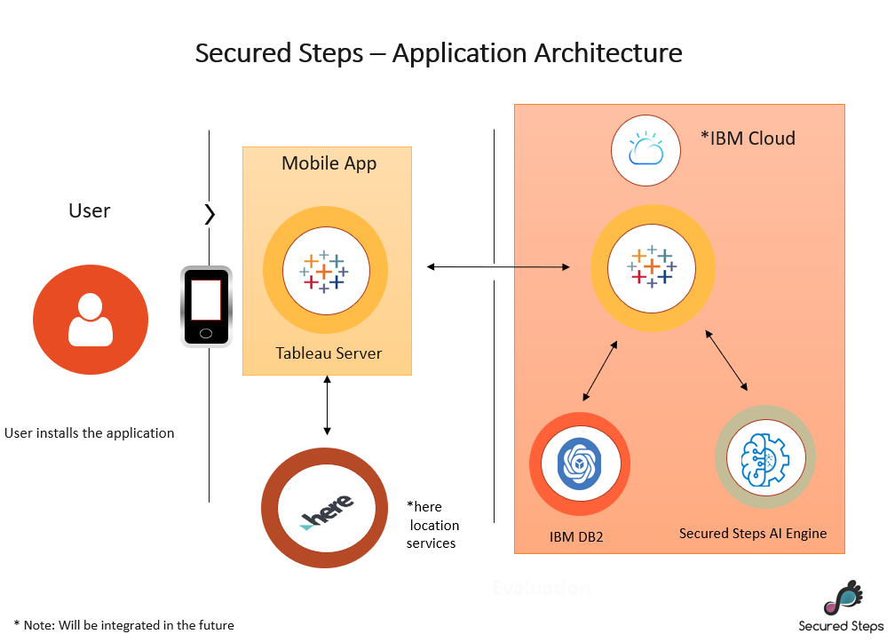
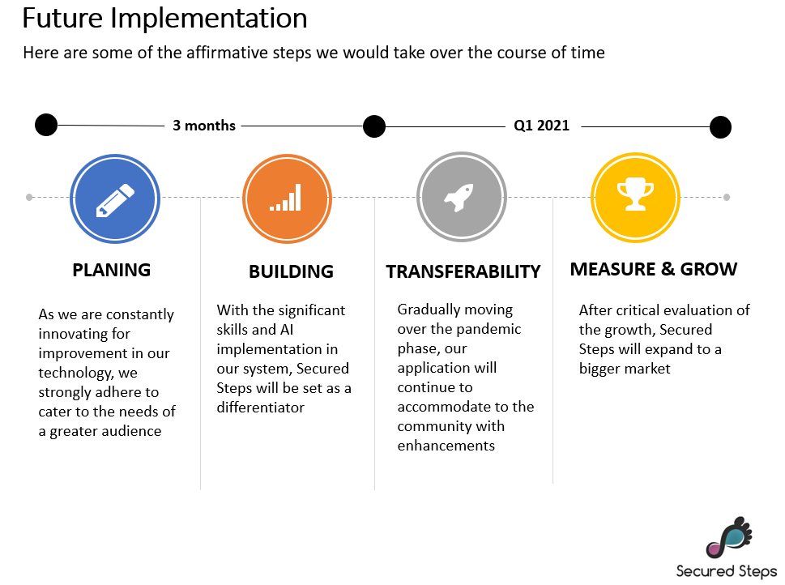

# WiT CallforCode: Sankalp-SecuredSteps

 

This is a basic GitHub repository by Team Sankalp, as part of WiT Hackathon 2020, for Call for Code.

## Contents

1. [Short Description](#short-description)
1. [Demo Video](#demo-video)
1. [The Architecture](#the-architecture)
1. [Long Description](#long-description)
1. [Project Roadmap](#project-roadmap)
1. [Getting Started](#getting-started)
1. [Access the Application](#Access-the-Application)
1. [Built With](#built-with)
1. [Contributors](#contributors)

## Short Description

### What's the problem?

Part of the World Health Organization's guidance on limiting further spread of COVID-19 is to practice social distancing. However, it is difficult to follow, especially in a densely crowded city like Bangalore. This is leading to people shutting themselves at home and finding it difficult to carry out their day to day important activities like visiting a Bank or Salon etc. This is creating hindrance in restarting of economy and is leading to job losses.

### How can technology help

Technology can enable people to know in advance about the number of people visiting an establishment and allow them to socially distance, whilst sitting comfortably at home. It can also enable people to plan their visit in safe and secure manner.

### The Idea

Team Sankalp is offering an innovative solution called SecuredSteps, which combines location and traffic data with power of Artificial Intelligence, to provide users an alert about an establishment, they would like to visit. A simple mobile app enables users to plan their visit in a secure manner and follow social distancing norms from comfort of their home.

## Demo Video

(https://www.youtube.com/watch?v=W6Fa_aaWRTk)

## The architecture

1. The user installs the site via playstore/app store.
2. Logs in via phone number/email
3. Provides his/her location and searches for nearby services
4. AI skills provides hotspots warnings for services selected. Additionally, app provides alternative locations for the services.
5. More people download/use the app, more AI skills the app gains, and better is the recommendations.

## Long description

[More detail is available here](https://github.com/WiTCallforCodeSankalp/SecuredSteps2020\WiTCallforCodeHackathonTeamSankalp.pdf)

## Project roadmap

## Getting started

These instructions will get you a copy of the project up and running on your local machine for development and testing purposes. See deployment for notes on how to deploy the project on a live system.

### Prerequisites

What things you need to install the software and how to install them

* Tableau
* IBM DB2
* Map Services

### Installing

A step by step series of examples that tell you how to get a development env running

Say what the step will be, for example

Get tableau installed from here https://help.tableau.com/current/desktopdeploy/en-us/desktop_deploy_download_and_install.htm 
Get access to IBM DB2 https://www.ibm.com/in-en/analytics/db2/trials 
Map Service : Kagel Housing data

## Access the Application

Click on : [Secured Steps](https://public.tableau.com/profile/hema3100#!/vizhome/WiTHackathon-SankalpTeam-SecuredSteps/Welcome?publish=yes) 

## Built with

* [IBM DB2](https://cloud.ibm.com/catalog?search=DB2#search_results)
* [Tableau]( https://public.tableau.com/en-us/s/)
* [Map Services](https://www.kaggle.com/amitabhajoy/bengaluru-house-price-data ) 
* Custome built AI Model

## Contributors

* **Athira Menon** - *Strategizing and Communication*
* **Hemalatha Dave** - *Conceptualization and Implimentation*
* **Shweta Kumari** - *Conceptualization and Data Engineering*
* **Sneha Agarwal** - *Strategizing and Communication*
